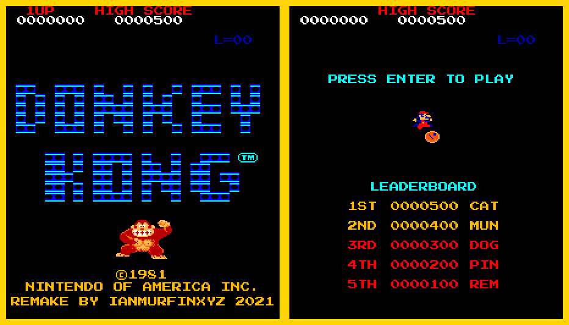
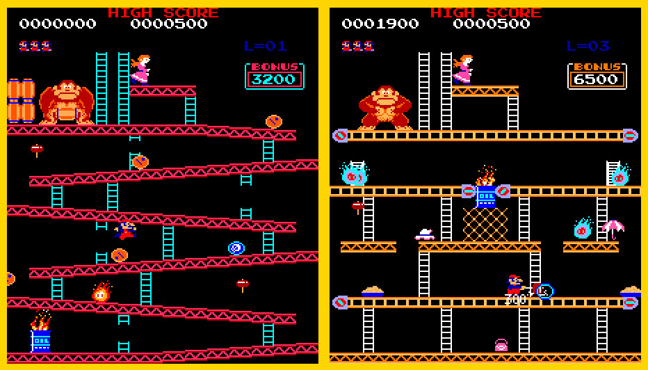
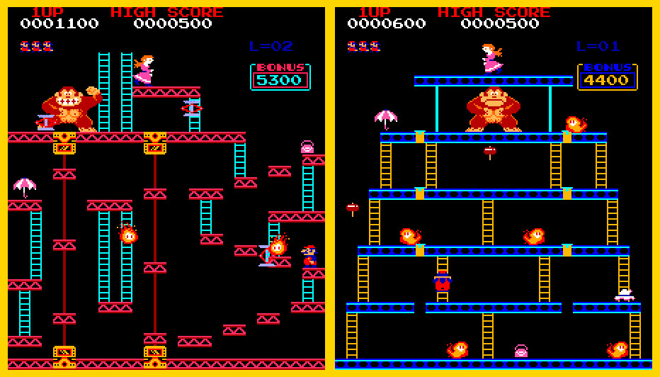

## Donkey Kong (1981) :joystick:

Feature complete remake of the 1981 arcade classic Donkey Kong built for modern x86-64 desktop machines, both
Windows and Linux. Implemented in C++ using Allegro5. 

I tried to keep this project authentic to the original and so the mechanics were programmed using reference to 
various sites which break down how the original source worked along with my own observations from videos on 
Youtube. Hence, some of the mechanics are accurate (like the rolling barrels) and some are similar but not
accurate (like the wild barrels). The gameplay 'feel' is also similar but not perfectly accurate, so mario likely runs
and jumps at a slightly different rate etc. I have also made changes (hopefully improvements) to make the
controls less clunky.

Features include:

- All 4 original stages (barrel, factory, elevators, rivets).
- Menu and title screens.
- High score tracking (via a local file).
- Barrels, including wild barrels.
- Firefox and fireballs.
- Bonus clock.
- Pauline's lost items.
- Hammer power-up.
- All cutscenes. 
- Lives system.
- and more.

I also included some of the quirks of the original such as being able to get score by jumping next to but not 
over mobs (including Kong).

The game dynamically resizes with window size, with the entire game being drawn to a 224x256px back buffer
and then scaled up to the largest size that will fit (centered) in the window. This allows the game to be played
fullscreen on any size monitor.

*Click this [Youtube link](https://www.youtube.com/watch?v=Hm3gQ7G5vNY&t) for a video playthrough of the game.*

There are also some other play throughs on my channel too, all just as nooby :smiley:, and yes I am aware there are a
few bugs left in the code, notably with the high score table. I will probably fix them at some point.

**Disclaimer: The assets have been stripped from this repo so as to not transgress Nintendo's 
copyright. This project was made purely for my own entertainment and is not for 
commercial use.**

<p align="center">
  
</p>
<p align="center">
  
</p>
<p align="center">
  
</p>

## Configuration

The game includes a configuration file which can be used to:

- control the window size.
- enabled/disable fullscreen/windowed modes.
- switch between different (hardcoded) control schemes.
- enable/disable 'classic mode' which controls level ordering (pointless currently as only original 4 levels included).
- enable/disable debug mode which allows skipping levels and debug drawing.
- enable/disable invulnerable mode which makes jump man immune to damage (useful for testing/debugging).

## Compilation

### Linux

The project has dependencies only on Allegro5, thus install those via your package manager, which
on arch linux this is done via pacman:

```shell
pacman -s allegro
```

then cd into the project directory and run cmake,

```shell
cmake .
make
```

### Windows

Windows requires an environment be setup for the compilation, I used mingw64 via MSYS2. Once you have the
environment setup you will need to install allegro into it, see the [allegro quickstart guide](https://github.com/liballeg/allegro_wiki/wiki/Quickstart)
for instructions on that. Then just run cmake in the MSYS2 terminal (or within your installed environment however you
do that):

```shell
cmake .
make
```
